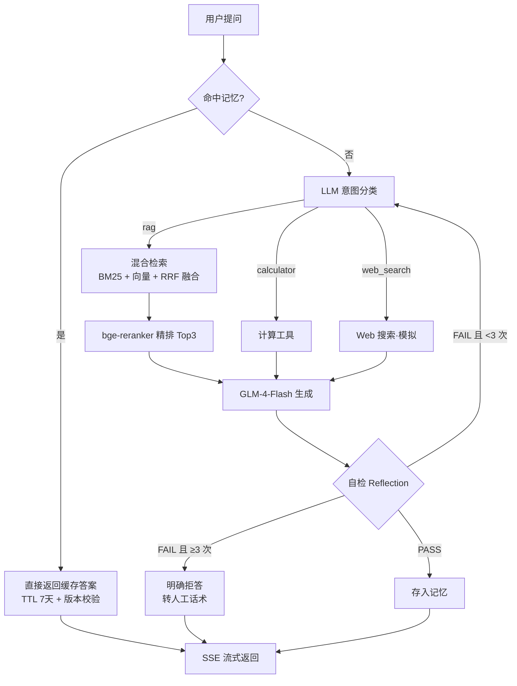

# 电商智能客服 Agent（LangGraph + RAG + 自检反思）

> 电商客服知识库问答机器人：混合检索 + 精排、多工具路由、失败自检重试、RAGAS 评估闭环；Agent 思考全过程 SSE 流式可见。

## 30 秒亮点

- **两段式检索**：BM25（jieba 分词）+ 向量检索双路召回，RRF 排名融合，bge-reranker CrossEncoder 精排 top10 → top3，相关文档从 top5 提升到 top1
- **LangGraph 状态机编排**：意图分类条件路由（rag / calculator / web_search / 记忆命中），生成后自检反思，FAIL 自动回炉重试，3 次失败明确拒答转人工
- **会话记忆缓存**：问答命中即秒回；TTL（7 天）+ 知识库版本号双失效，知识库更新后旧缓存自动作废，不吐过期答案
- **评估驱动迭代**：RAGAS 四指标量化（faithfulness 0.95），用评估结论反推分块与检索策略
- **工程化细节**：SSE 流式（防代理缓冲头）、API Key 全环境变量隔离、demo 口令 + 每 IP 限流、Docker 一键启动、健康检查接口

## 快速体验（本地 3 步）

```bash
# 1. 准备环境变量（不要提交到 git）
cat > .env << 'EOF'
ZHIPU_API_KEY=你的智谱key
DEMO_KEY=演示访问口令
EOF

# 2. 构建镜像（CPU 版 torch 走国内镜像，约 15-25 分钟）
docker build -t rag .

# 3. 启动（首次启动自动入库 + 自动下载 reranker 模型约 1.1G）
docker run -d --name rag --restart always \
  --env-file .env -p 80:8000 \
  -v rag-model:/app/.cache_model \
  -v rag-chroma:/app/chroma_db \
  rag

# 健康检查
curl http://localhost/health
# 浏览器打开 http://localhost 输入 DEMO_KEY 即可对话
```

建议问它：
- `iPhone 15 的电池容量是多少？`（走 RAG 检索）
- `退货政策是什么？几天可以退？`（走 RAG 检索）
- `计算 5999 减 3999 等于多少`（路由到计算器）
- `今天北京天气怎么样`（路由到 Web 搜索，演示意图分流）

首次启动流程：加载检索组件 → 检测向量库为空自动入库（调 embedding API，64 条/批分批）→ 下载 reranker 模型 → `Application startup complete`。数据卷保证容器重建后不重下模型、不重建向量库。

## 架构

在线问答链路：



离线知识库链路（Airflow 每日调度）：


## 技术栈

| 层 | 选型 | 说明 |
|---|---|---|
| LLM | GLM-4-Flash | 智谱 API，temperature=0 保证稳定 |
| Embedding | embedding-2 | 智谱，64 条限制所以分批入库 |
| 向量库 | Chroma | 本地持久化目录 |
| 稀疏检索 | BM25Retriever + jieba | 中文必须先分词 |
| 融合 | RRF（k=60） | 只看排名不看分数量纲，免调参 |
| 重排 | BAAI/bge-reranker-base | CrossEncoder，粗排 top10 精排到 top3 |
| 编排 | LangGraph | 状态机 + 条件路由 + 反思回环 |
| 接口 | FastAPI + SSE | 思考过程逐步推送到浏览器 |
| 评估 | RAGAS | faithfulness / relevancy / precision / recall |
| 调度 | Airflow | 每日增量更新知识库并重跑评估 |
| 部署 | Docker + uvicorn | 单 worker（向量库/记忆文件不支持多进程写），数据卷持久化 |

## 评估结果（RAGAS，20 题测试集）

| 指标 | 得分 | 解读 |
|---|---|---|
| faithfulness | 0.95 | 答案几乎全部可溯源到检索内容，幻觉被压制 |
| context_recall | 0.80 | 应召回内容基本找齐，漏检少 |
| answer_relevancy | 0.65 | 被拒答类场景稀释（拒答时 relevancy 天然低分） |
| context_precision | 0.50 | 同上：拒答类问题无相关文档可召回，属预期行为而非检索缺陷 |

测试集覆盖四类场景：事实查询、跨文档综合、权限边界、无答案（拒答）。已知局限：样本量 20 题偏小、四类场景混算。改进方向：按场景分组统计（事实类看 faithfulness/recall，拒答类看拒答正确率），并把测试集扩到 100 题。

## 安全与可靠性设计

- API Key、访问口令全部走 `.env` 环境变量，不进代码不进 git（`.gitignore` / `.dockerignore` 双重排除）
- 在线 demo 必须带口令访问（403 拦截）+ 每 IP 60 秒 10 次内存限流（429），防接口被刷产生 API 账单
- 问答缓存双失效：TTL 7 天 + 知识库版本号，Airflow 更新知识库后旧缓存自动作废
- 自检 3 次失败降级为明确拒答并提示转人工（正确拒答优于硬编）
- 记忆文件写入加线程锁，避免并发覆盖

## 踩坑记录（均为本项目实际遇到）

1. **pip 装 CPU 版 torch 报 `flit_core` 缺失**：pytorch 官方 cpu index 只有 torch 大件，纯 Python 依赖的构建工具不在里面；解法是先从清华源装齐 `typing-extensions/sympy/networkx` 等小包，再装 torch 本体
2. **国内拉 Docker Hub 基础镜像超时**：配置 registry-mirrors 镜像加速；或先从镜像站 pull 再 `docker tag` 改名
3. **SSH 断线杀死前台 docker build**：改用 `nohup ... > build.log 2>&1 &` 后台构建，断线免疫
4. **智谱 embedding 单次最多 64 条**：入库按 50 一批分批调用
5. **BM25 中文检索质量差**：默认按空格分词对中文无效，必须传 jieba 的 `preprocess_func`
6. **RAGAS 指标被拒答场景稀释**：拒答类问题无相关文档，precision/relevancy 天然低分，指标应按场景分组看
7. **SSE 流式会被反向代理缓冲憋成一次性输出**：响应头加 `X-Accel-Buffering: no` 预防
8. **langchain-community 的 Chroma 有废弃警告**：锁版本使用，社区包仍在维护期内
9. **git 推送前必须检查密钥**：曾发现 API Key 明文写在代码里已推到公开仓库，立即作废轮换 + 改环境变量读取——养成 `git status` 审查习惯

## 已知局限与规划

- web_search 工具目前是模拟（返回提示文本），规划接入真实搜索 API
- 记忆文件 + Chroma 单文件库决定了单 worker 架构；多实例需换 PostgreSQL 向量方案
- 评估样本 20 题，规划扩到 100 题 + 分组置信区间
- 规划上线公网 demo（服务器部署 + 口令访问），并接入线上 Bad case 回流：拒答/低分问题自动进入待标注集
